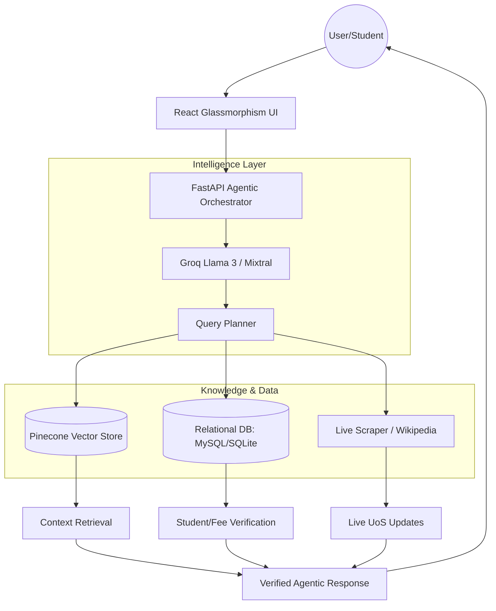

# 🎓 University of Swat (UoS) Agentic ChatBot

A state-of-the-art, AI-driven assistant for the University of Swat. This project combines **Agentic RAG**, **Real-time Relational Databases**, and a **Premium UI** to provide students and faculty with instant, verified information.


## 🚀 Key Features

- **🤖 Agentic Reasoning**: Uses a dual-model orchestration (Planner/Responder) to intelligently choose between internal knowledge, live web search, or database queries.
- **📊 Real-time Data Verification**: Directly connected to a **MySQL/SQLite** backend for verifying student roll numbers, fee slips, and faculty details.
- **🔍 Smart Search**: Integrates **Pinecone** for document-based RAG and **Groq** for lightning-fast inference.
- **🌐 Live Web Integration**: Capable of scraping official university news and fetching global data via Wikipedia.
- **💎 Premium UI**: A high-end glassmorphism interface with floating animations, responsive design, and intuitive user journey.
- **🔌 Hybrid DB Layer**: Seamlessly switches between MySQL (Local) and SQLite (Cloud/Hugging Face) for 100% platform compatibility.

## 🏗️ System Architecture



## 📂 Folder Structure

- `backend/`: FastAPI Python application with Agentic RAG logic and DB services.
- `frontend/`: React (Vite) application with premium glassmorphism styling.
- `data/`: Document knowledge base for vector ingestion.

## 🚀 Setup & Installation

### 1. Prerequisites
- Python 3.9+ & Node.js 18+
- Groq API Key & Pinecone API Key
- MySQL Server (Optional for local, defaults to SQLite)

### 2. Backend Setup
```bash
cd backend
python -m venv venv
source venv/bin/activate  # Windows: venv\Scripts\activate
pip install -r requirements.txt
```
**Configure `.env`:**
```env
GROQ_API_KEY=your_key
PINECONE_API_KEY=your_key
MYSQL_HOST=localhost
MYSQL_USER=root
MYSQL_PASSWORD=your_password
MYSQL_DATABASE=uos_chatbot
```
**Run:** `uvicorn app.main:app --reload`

### 3. Frontend Setup
```bash
cd frontend
npm install
npm run dev
```

## 🧠 Agentic Tools
The bot is equipped with several custom tools:
- `lookup_student_by_roll_no`: Real-time student verification.
- `lookup_fee_by_reference`: Instant bank slip status check.
- `lookup_faculty_info`: Department-wise faculty details.
- `fast_scrape_university_news`: Latest official UoS announcements.
- `deep_scrape_with_playwright`: Advanced web content analysis.

## 📄 License
Distributed under the MIT License. See `LICENSE` for more information.

---
**Built for the University of Swat with ❤️ by Ikram**
